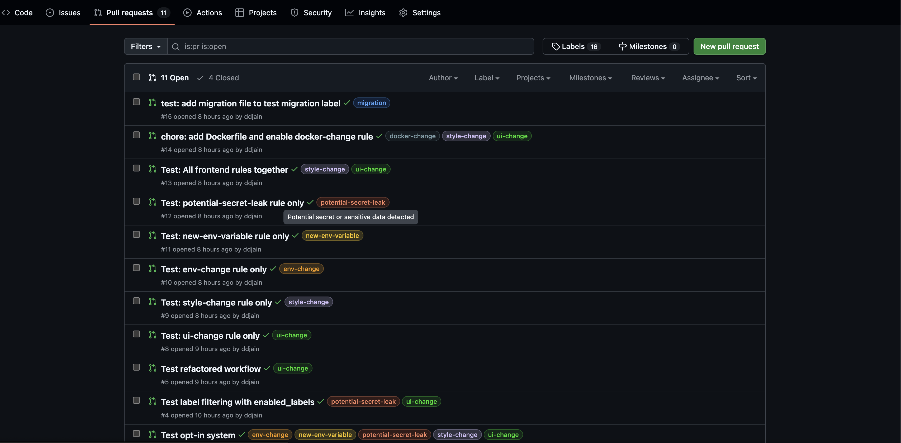

# 🏷️ PR Auto-Labeler

> **Automatically label your pull requests** based on code changes, patterns, and metadata. Set up in 2 minutes.

[](https://github.com/workflow-kit/pr-auto-labeler)
[](LICENSE)
[](https://github.com/workflow-kit/pr-auto-labeler)

<!-- Usage & Analytics Badges -->
[](https://github.com/workflow-kit/pr-auto-labeler/stargazers)
[](https://github.com/workflow-kit/pr-auto-labeler/network/members)
[](https://github.com/workflow-kit/pr-auto-labeler/watchers)
[](https://github.com/workflow-kit/pr-auto-labeler/issues)
[](https://github.com/workflow-kit/pr-auto-labeler/pulls)
[](https://github.com/workflow-kit/pr-auto-labeler/network/dependents)
[](https://github.com/workflow-kit/pr-auto-labeler/commits/main)
[](https://github.com/workflow-kit/pr-auto-labeler/releases)

## 📸 See It In Action



*Labels are automatically applied to your pull requests based on the changes made - no manual effort required!*

---

## 🚀 Quick Setup

### Step 1: Create Workflow File

Create `.github/workflows/pr-labeler.yml`:

```yaml
name: Auto Label PRs

on:
  pull_request:
    types: [opened, synchronize, reopened]

permissions:
  contents: read
  pull-requests: write

jobs:
  label:
    uses: workflow-kit/pr-auto-labeler/.github/workflows/pr-auto-labeler.yml@v0.0.1
    with:
      # ⚠️ IMPORTANT: Enable the rules you want (all disabled by default)
      enabled_rules: '["ui-change", "env-change", "potential-secret-leak", "large-pr", "test-missing"]'
```

### Step 2: Commit & Push

```bash
git add .github/workflows/pr-labeler.yml
git commit -m "Add PR auto-labeler"
git push
```

### Step 3: Done! ✅

Create a pull request and labels will be applied automatically based on your enabled rules.

---

## 📋 Available Rules

Choose which rules to enable from the comprehensive list below. **All rules are disabled by default** - you must explicitly enable the ones you want.

### 🎨 Frontend & UI Rules

| Rule Name | Label | Detects | Use Case |
|-----------|-------|---------|----------|
| `ui-change` | 🟢 `ui-change` | Frontend component files (`.jsx`, `.tsx`, `.vue`, `.html`) | Track UI/component changes |
| `style-change` | 🟣 `style-change` | Style-only changes (`.css`, `.scss`, `.sass` without JS) | Identify cosmetic-only changes |

**Example:**
```yaml
enabled_rules: '["ui-change", "style-change"]'
```

---

### 🗄️ Database Rules

| Rule Name | Label | Detects | Use Case |
|-----------|-------|---------|----------|
| `migration` | 🔵 `migration` | Migration files in `migrations/`, `db/migrations/` | Track all DB migrations |
| `risky-migration` | 🔴 `risky-migration` | Dangerous SQL operations (DROP, TRUNCATE, ALTER DROP) | Flag high-risk migrations |
| `schema-change` | 🟡 `schema-change` | Schema modifications (ALTER, RENAME, MODIFY COLUMN) | Track schema changes |
| `safe-migration` | 🟢 `safe-migration` | Safe additive migrations (CREATE, INSERT, ADD COLUMN) | Identify low-risk migrations |

**Example:**
```yaml
enabled_rules: '["migration", "risky-migration", "safe-migration"]'
```

---

### 🔧 Environment & Configuration Rules

| Rule Name | Label | Detects | Use Case |
|-----------|-------|---------|----------|
| `env-change` | 🟠 `env-change` | Environment files (`.env`, `config.yml`, `config.json`) | Track configuration changes |
| `new-env-variable` | 🟡 `new-env-variable` | New environment variables added in diffs | Flag new configuration |
| `potential-secret-leak` | 🔴 `potential-secret-leak` | Keywords: `API_KEY`, `PASSWORD`, `SECRET`, `TOKEN` | Security review required |

**Example:**
```yaml
enabled_rules: '["env-change", "new-env-variable", "potential-secret-leak"]'
```

---

### 🧪 Testing Rules

| Rule Name | Label | Detects | Use Case |
|-----------|-------|---------|----------|
| `test-only-change` | 🟢 `test-only-change` | Only test files modified, no source changes | Fast-track test improvements |
| `test-missing` | 🔴 `test-missing` | Source code changed without corresponding test changes | Require tests for code changes |
| `test-improvement` | 🟡 `test-improvement` | Tests added/improved with source changes | Acknowledge good testing practices |

**Example:**
```yaml
enabled_rules: '["test-only-change", "test-missing", "test-improvement"]'
```

---

### 📦 Dependency Rules

| Rule Name | Label | Detects | Use Case |
|-----------|-------|---------|----------|
| `dependency-change` | 🟠 `dependency-change` | Changes to `package.json`, `requirements.txt`, `Gemfile`, etc. | Track dependency updates |
| `new-dependency` | 🟡 `new-dependency` | New dependencies added to project | Review new external dependencies |
| `dependency-downgrade` | 🔴 `dependency-downgrade` | Dependency versions downgraded | Flag potential security/compatibility issues |

**Example:**
```yaml
enabled_rules: '["dependency-change", "new-dependency", "dependency-downgrade"]'
```

---

### 🔄 CI/CD & Infrastructure Rules

| Rule Name | Label | Detects | Use Case |
|-----------|-------|---------|----------|
| `ci-change` | 🔵 `ci-change` | CI workflow changes (GitHub Actions, GitLab CI, CircleCI, Jenkins) | Track CI/CD modifications |
| `docker-change` | ⚫ `docker-change` | Docker files (`Dockerfile`, `docker-compose.yml`, `.dockerignore`) | Track containerization changes |
| `infra-change` | 🟣 `infra-change` | Infrastructure configs (Terraform, Kubernetes, Helm, Ansible) | Track infrastructure as code |

**Example:**
```yaml
enabled_rules: '["ci-change", "docker-change", "infra-change"]'
```

---

### 🔒 Security Rules

| Rule Name | Label | Detects | Use Case |
|-----------|-------|---------|----------|
| `security-change` | 🔴 `security-change` | Changes in security-sensitive areas (auth, crypto, JWT, OAuth) | Require security review |
| `risky-code` | 🔴 `risky-code` | Dangerous patterns (`eval`, `exec`, `dangerouslySetInnerHTML`) | Flag potentially unsafe code |

**Example:**
```yaml
enabled_rules: '["security-change", "risky-code"]'
```

---

### 🧠 Code Semantics Rules

| Rule Name | Label | Detects | Use Case |
|-----------|-------|---------|----------|
| `function-removed` | 🔴 `function-removed` | Functions or classes removed from codebase | Flag breaking changes |
| `new-feature` | 🟢 `new-feature` | New features added (new files, "feat:" commits) | Highlight feature additions |
| `non-functional-change` | ⚪ `non-functional-change` | Documentation/text-only changes (no code) | Fast-track doc updates |
| `refactor` | 🟡 `refactor` | Code refactoring or multiple file renames | Identify code cleanup |

**Example:**
```yaml
enabled_rules: '["function-removed", "new-feature", "refactor"]'
```

---

### 📊 PR Meta Rules

| Rule Name | Label | Detects | Use Case |
|-----------|-------|---------|----------|
| `large-pr` | 🔴 `large-pr` | PRs with >500 lines changed | Flag PRs that need splitting |
| `missing-description` | 🟡 `missing-description` | PR description <30 characters | Require better PR descriptions |
| `no-linked-issue` | 🟡 `no-linked-issue` | No issue linked (`Closes #123`, `Fixes #456`) | Ensure issue tracking |
| `work-in-progress` | 🟠 `work-in-progress` | Draft PRs or titles with "WIP", "DNM" | Flag incomplete work |

**Example:**
```yaml
enabled_rules: '["large-pr", "missing-description", "no-linked-issue", "work-in-progress"]'
```

---

## 🎯 Common Configuration Examples

### 🏢 **Full-Stack Team**
```yaml
enabled_rules: '[
  "ui-change", "style-change",
  "test-missing", "test-improvement",
  "dependency-change", "new-dependency",
  "large-pr", "missing-description"
]'
```

### 🔒 **Security-Focused**
```yaml
enabled_rules: '[
  "potential-secret-leak",
  "security-change",
  "risky-code",
  "risky-migration",
  "dependency-downgrade"
]'
```

### 🎨 **Frontend Team**
```yaml
enabled_rules: '[
  "ui-change",
  "style-change",
  "test-missing",
  "dependency-change"
]'
```

### 🗄️ **Backend/Database Team**
```yaml
enabled_rules: '[
  "migration",
  "risky-migration",
  "safe-migration",
  "test-missing",
  "new-dependency"
]'
```

### ⚙️ **DevOps/Platform Team**
```yaml
enabled_rules: '[
  "ci-change",
  "docker-change",
  "infra-change",
  "env-change",
  "security-change"
]'
```

### 📝 **Quality Enforcement**
```yaml
enabled_rules: '[
  "large-pr",
  "test-missing",
  "missing-description",
  "no-linked-issue",
  "risky-code"
]'
```

---

## ⚙️ Advanced Configuration

### Custom Label Names

Override default label names with your own:

```yaml
enabled_rules: '["ui-change", "test-missing"]'
label_overrides: '{
  "ui-change": "frontend",
  "test-missing": "needs-tests"
}'
# Will apply "frontend" and "needs-tests" labels instead
```

### Debug Mode

Enable detailed logging to troubleshoot rule execution:

```yaml
enabled_rules: '["ui-change"]'
enable_debug: true
# Shows: files analyzed, rules executed, patterns matched, labels applied
```

### Complete Configuration Example

```yaml
name: Auto Label PRs

on:
  pull_request:
    types: [opened, synchronize, reopened]

permissions:
  contents: read
  pull-requests: write

jobs:
  label:
    uses: workflow-kit/pr-auto-labeler/.github/workflows/pr-auto-labeler.yml@v0.0.1
    with:
      enabled_rules: '[
        "ui-change",
        "test-missing",
        "potential-secret-leak",
        "large-pr",
        "missing-description"
      ]'
      label_overrides: '{
        "ui-change": "frontend",
        "test-missing": "needs-tests"
      }'
      enable_debug: false
```

---

## 📊 Configuration Options Reference

| Parameter | Type | Required | Default | Description |
|-----------|------|----------|---------|-------------|
| `enabled_rules` | JSON Array | ✅ Yes | `[]` | List of rule names to enable |
| `label_overrides` | JSON Object | No | `{}` | Custom label name mappings |
| `enable_debug` | Boolean | No | `false` | Enable verbose debug logging |

---

## 🐛 Troubleshooting

### ❌ Labels Not Applied?

1. **Check if rules are enabled** - All rules are disabled by default!
   ```yaml
   enabled_rules: '["ui-change"]'  # Must not be empty!
   ```

2. **Enable debug mode** to see execution details:
   ```yaml
   enable_debug: true
   ```

3. **Check workflow logs** for messages:
   - `⚠️ No rules enabled` - Add rules to `enabled_rules`
   - `⚠️ No rules loaded` - Check rule names are correct
   - `✅ Applied labels: [...]` - Shows which labels were applied

### ❌ Workflow Not Running?

1. ✅ Verify file location: `.github/workflows/pr-labeler.yml`
2. ✅ Check `permissions` block includes `pull-requests: write`
3. ✅ Ensure GitHub Actions is enabled in repository settings
4. ✅ Confirm PR trigger is set: `on: pull_request:`

### ❌ Some Rules Not Working?

1. ✅ Check rule name spelling in `enabled_rules`
2. ✅ Enable `enable_debug: true` to see which rules execute
3. ✅ Verify your changes match the rule's detection patterns
4. ✅ Check if `label_overrides` has typos

---

## 📝 Real-World Examples

### Example 1: Frontend PR
**Changed files:** `src/components/Button.tsx`, `styles/button.css`

**Config:**
```yaml
enabled_rules: '["ui-change", "style-change", "test-missing"]'
```

**Result:** Gets labels `ui-change`, `style-change`, and `test-missing` (if no test changes)

---

### Example 2: Database Migration PR
**Changed files:** `db/migrations/20240101_add_users.sql` with `CREATE TABLE users`

**Config:**
```yaml
enabled_rules: '["migration", "safe-migration", "risky-migration"]'
```

**Result:** Gets labels `migration` and `safe-migration` (CREATE is safe)

---

### Example 3: Security Review PR
**Changed files:** `src/auth/login.ts`, added `eval(userInput)`

**Config:**
```yaml
enabled_rules: '["security-change", "risky-code", "test-missing"]'
```

**Result:** Gets all three labels - requires security review!

---

### Example 4: Large Refactoring PR
**Changed files:** 15 files, 800 lines changed, multiple renames

**Config:**
```yaml
enabled_rules: '["large-pr", "refactor", "test-missing"]'
```

**Result:** Gets `large-pr` (>500 lines), `refactor` (many renames)

---

## 🎓 Best Practices

### ✅ **Start Small**
Begin with 3-5 essential rules, then expand:
```yaml
enabled_rules: '["large-pr", "test-missing", "potential-secret-leak"]'
```

### ✅ **Combine Related Rules**
Group rules by concern:
```yaml
# Security bundle
enabled_rules: '["security-change", "risky-code", "potential-secret-leak"]'
```

### ✅ **Use Custom Labels**
Match your team's existing label conventions:
```yaml
label_overrides: '{"ui-change": "area/frontend", "test-missing": "needs-tests"}'
```

### ✅ **Enable Debug for New Rules**
When adding new rules, debug first:
```yaml
enable_debug: true  # Remove after verifying
```

---

## 🤝 Contributing

Want to add a new rule or improve existing ones? See [CONTRIBUTING.md](CONTRIBUTING.md) for:
- Rule development guide
- Testing requirements
- How to test locally
- Contribution workflow

---

## 📊 Usage Analytics

Want to see how widely this action is used? Here's what the badges track:

| Badge | What It Measures | Why It Matters |
|-------|------------------|----------------|
| ⭐ **Stars** | Community interest & endorsement | Shows how many developers find this useful |
| 🔱 **Forks** | Active usage & customization | Indicates real adoption (people building on it) |
| 👁️ **Watchers** | Active monitoring | Shows engaged users tracking updates |
| 🔗 **Used by** | Public repos using this action | Direct measure of adoption in production |
| 📝 **Issues/PRs** | Community engagement | Shows active maintenance & support |

**Note:** GitHub only tracks public repository usage. Private repos using this action won't appear in these metrics, so actual usage is likely **2-5x higher** than shown.

### How Marketplace Analytics Work

Once published to GitHub Marketplace (coming soon!), you'll get access to:
- ✅ Download counts
- ✅ Installation metrics
- ✅ Usage trends over time
- ✅ Geographic distribution

The Marketplace insights will be available at: `github.com/marketplace/actions/YOUR-ACTION-NAME` (after publication).

---

## 📚 Documentation

- **📖 Design Philosophy:** [docs/DESIGN.md](docs/DESIGN.md)
- **🤝 Contributing Guide:** [CONTRIBUTING.md](CONTRIBUTING.md)
- **💬 Discussions:** [GitHub Discussions](https://github.com/workflow-kit/pr-auto-labeler/discussions)
- **🐛 Report Issues:** [GitHub Issues](https://github.com/workflow-kit/pr-auto-labeler/issues)

---

## 📜 License

MIT License - see [LICENSE](LICENSE) for details.

---

**Made with ❤️ by the open-source community**

⭐ Star this repo if it helps your workflow!
